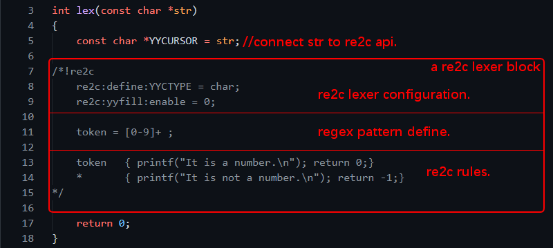

# <a id="OneMinimalExample">A minimal re2c lexer example.</a>

This example will show you how to distinguish a string is a number or not number. There are some re2c terminologies you may need unterstand as this picture showed. 


The full source code is at this project/tests directory. If you want to compile and run this example, the command can be:
```
re2c test01.lex -o test01.c     ## compile to C language code.
gcc test01.c -o test01.exe      ## compile to binary.
./test01.exe                    ## execute it.
```

There are many **re2c apis** in the official document. Some can read and write is called **Left-Value**, some can only read is called **Right-Value** and some should be initialized(connected) before re2c start working.  

The **YYCURSER** api is always point to user stream and read data by re2c from the stream as a forward-iterator(a pointer read current position and go to next position if possible, and it never goes back).

A **re2c lexer block** is a standalone working block(it may be not standalone because code in a block can jump to other blocks, to be clear you can just accept this standalone idea for now). User can have multiple blocks or reuse blocks in one code file. The block can have three part as the picture showed.

The **re2c lexer configureation** can influence how it works. For example, you may need utf8/ucs2/utf32 support, or you may need multi-shot-blocks support, or you may need condition support and so on.  

A **re2c rule** define is:  ` <regex> {<user-code>}  `, When re2c read user input stream and if it matches the regex-pattern, it will run the user-code. It has these behaviors:  
  1. **Before re2c-lexer parsing the \<regex>**, **YYCURSER** point to stream begin or last-lexer-finshed-position(Let me call it **FinishState1**).
  2. **Before run the \<user-code>**, the **YYCURSER** point to next parsing start(Let me call it **FinishState2**). So before run the user code, length(**FinishState2** - **FinishState1**) is current matched token length, and this token-string-start-position is **FinishState1's YYCURSER's position**.
  3. **After run the rule's user-code**, if the user-code is just empty or the user-code has no **break/continue/return**, re2c will will fall down to other rule(s) if exist. 
  4. **After run the rule's user-code**, because **YYCURSER** is a forward-iterator, re2c lexer will "forget and discard" user input stream before **FinishState2's YYCURSER's position**. So you need take a snapshot/backup of this position if you want get the token after next loop.

The default rule `<*> {}` has lowerest priority no matter where user define it in a re2c-lexer-block, and this rule should always provided by user. If all rules's user-code is empty and re2c-lexer is in a loop, it may be a dead loop, so the user-code should always provide **break/continue/return**. If user have many rules in a re2c-lexer-block, he(she) may need carefully design the rule and rule-orders. For example it may be hard to guess which rule will run first if  `"123456"{}` and `"123"{}` both present, may be you could always put your possible longest match string's pattern-rule to the front.

 > The full source file is project/tests/test01.lex 