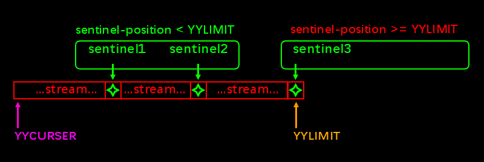

# <a id="HandleEofMore">Handle end of stream if more than one sentinel character exist.</a>
To handle string like  `const char str[] = "hello \0 world \0"`, you can use re2c **YYLIMIT** api with sentinel. YYLIMIT is just a pointer like YYCURSER, the difference is that YYCURSER point to next-reading-position but YYLIMIT point to last sentinel. This is the image.  
  
The handle end of stream logic may be:
```
if((++YYCURSER meet any_sentinel) && position(any_sentinel) < YYLIMIT)
{
    go ahead;
}
else
{
    It is the last sentinel, we should end-of-stream(or refill the buffer and go ahead);
}
```
In order to work in this multi-sentinel-mode, follow things should be done.  
> Note: there are diffenent api-style or api-using-style in re2c, it is may not actually code, you just need understand its meaning.  
 1. using re2c configuration.
    ```
    re2c:eof = the_sentinel_char_value;
    YYLIMIT = last_sentinel_position;
    ```
 2. using **re2c eof rule**.
    ```
    $  { using_this_to_handle_end_of_stream }
    ```

> The full source file is project/tests/test03.lex 