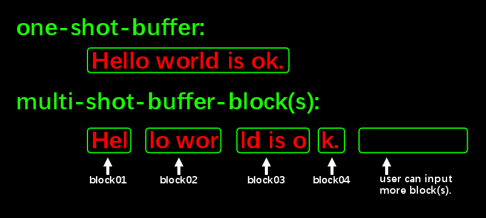

# <a id="SectionGetTokens">How to get tokens from re2c lexer.</a>
Because there are various apis/configurations/command-line-options in re2c, user may perplex:
 1. What combination of these stuff is vaild and what combination may not valid?  
 2. When and where and how to use these stuff?
 3. What is the **conventional-usage** or **design-pattern** if possible/available?  

For the conventional usage, this document will give you four possible usage. The detial of the sources will be refered in later chapters.  
|                 | One-shot-buffer       | Multi-shot-buffer      |
| :-------------- | :---------------------| :--------------------- |
| **SyncMode**<br>(Read-tokens-inside-lexer)| [source](../tests/test06.lex) | [source](../tests/test08.lex)|
| **AsyncMode**<br>(Read-tokens-outside-lexer)| [source](../tests/test07.lex) | [source](../tests/test09.lex)|

When working with **One-shot-buffer**.  
 - User should provide only one stream/buffer.  
 - The stream/buffer ought to be atomic.  

When working with **Multi-shot-buffer**.  
 - User do not need provide only one stream/buffer block. 
 - User can provide many buffer blocks.  
 - A buffer block do not need to be atomic.  
 - Before re2c-lexer start, you should provide(initialize) re2c-lexer a **working memory** to work with the blocks.
 - re2c-lexer will interrupt/ask for more/next buffer block when finish current work.
 - If user provide next buffer block, re2c-lexer will refill its **working memory** with the block and continue work.
 - User should always provide this re2c configuration
    ```
    // The an_user_id is used by re2c-lexer to tell user to 
    // handle the interrupt: lexer need more/next input.
    re2c:define:YYFILL = "return an_user_id;"
    ```   


For the design-pattern, this project have designed a re2c context library in the project/src folder. it wraps some conventional re2c-api-usage and can be used to do the arduous work for you.
  - **context** is used for one-shot-buffer in **SyncMode/AsyncMode**.  
  - **context2** is used for multi-shot-buffer in **SyncMode/AsyncMode**. 
