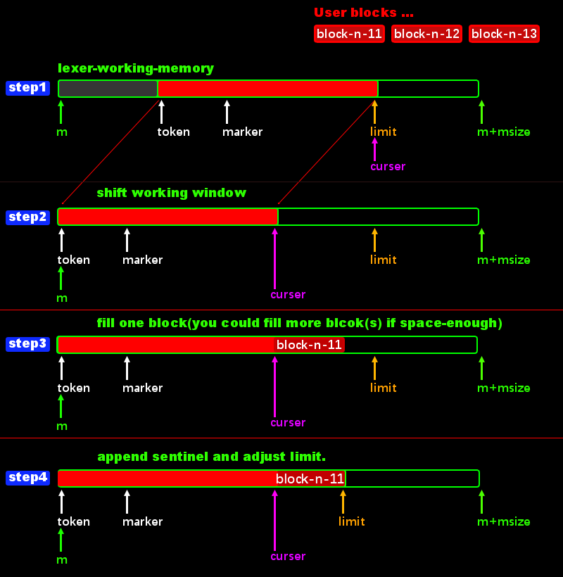

# <a id="GetTokensSyncMulti">Get tokens in sync-mode with multi-shot-buffer.</a>
Before read this section, you should have read previous section. 

The changes between previous section and this section are:
 1. I have switched the custom-context in the code to context2 library provided in this project/src folder.
 2. You just need process lexer-interrupt: `LexerNeedMoreInput` outside the lexer-function.
    ```
    if (ret == LexerNeedMoreInput)
    {
        //...code...
    }
    ```
 3. In above code, if you have buffer-blocks to fill, before filling, you should using `contex2.get_free_size()` to calculate whether the free space is enough to hold you input block(s). If you have no block(s) to input/fill or if you have finished input all your block(s), you can just ignore this interrupt, and the lexer will finally go to this eof rule `${}`.
 4. That's all, and don't forget to append re2c comiple option: **--storable-state** when compile your code.

The filling logic.  


> The full source file is project/tests/test08.lex